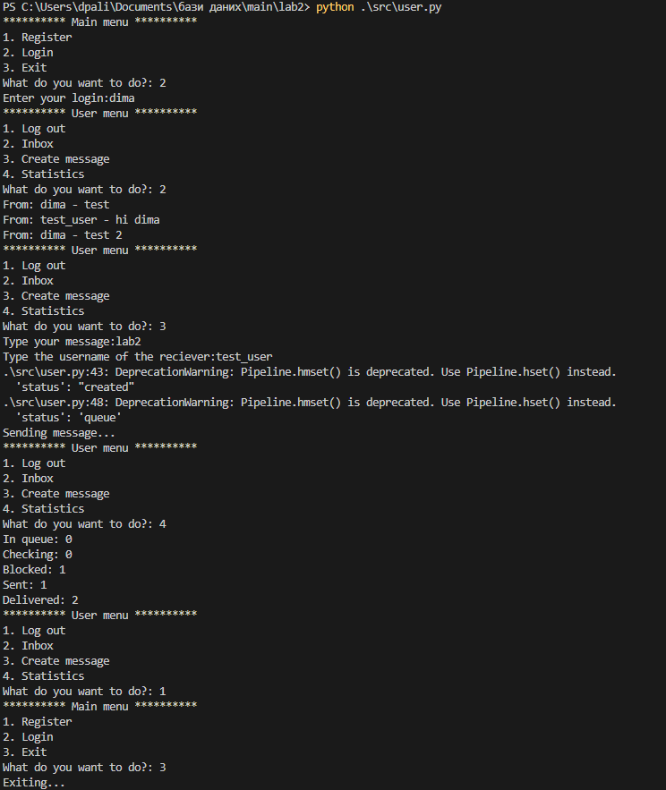
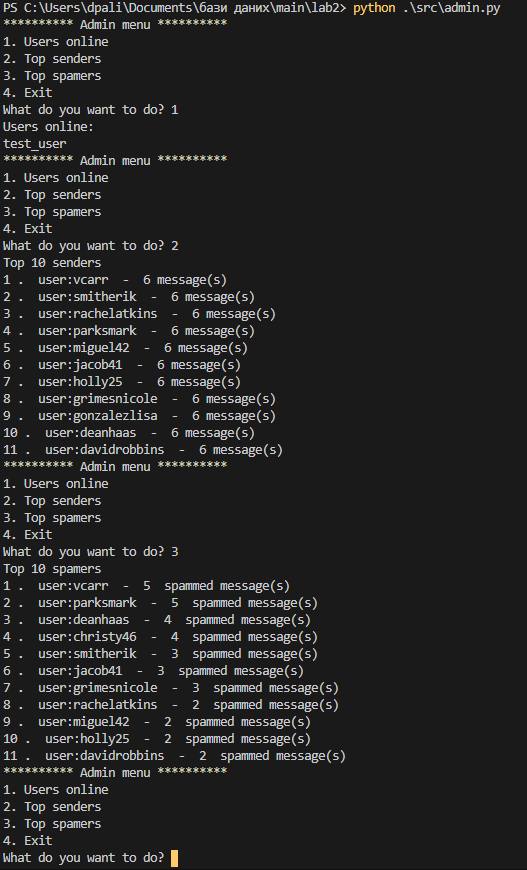
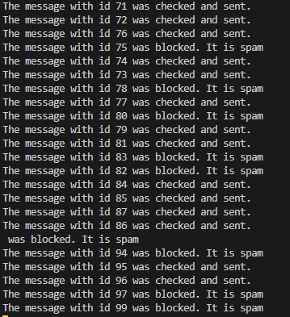
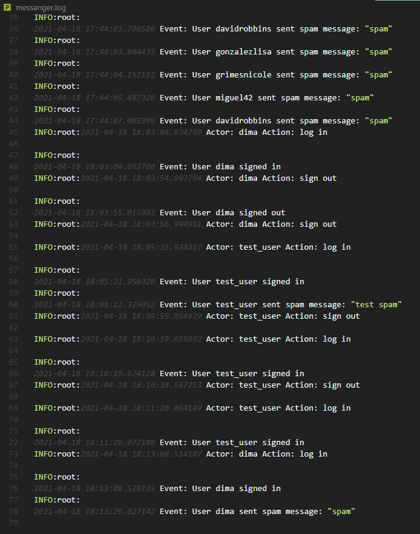

# Лабораторна робота No 2. Практика використання серверу Redis

Виконав: Палій Дмитро, КП-83

## Структура даних

Для зберігання повідомлень використана хештаблиця, так як вона дозоволяє зберігати ключ та значення. Ключем виступає id повідомлення, значенням - ім'я користувача-відправника, користувача-отримувача, текст повідомлення.

Для зберігання користувачів використана множина (Set), так як нам неважливий їх порядок, але важлива швидкість доступу до них.

Для черги повідомлень використувоється List, так як нам важливий порядок доданих записів, та час додавання та вилучення, який у випадку використання List є константним.

## Опис умов експерименту

Спамом вважаеться таке повідомлення, в тексті якого міститься підстрока 'spam'.

У режимі емуляції програма створює 5 користувачів, які паралельно надсилають по 6 повідомленнь, які можуть містити допустимий текст або текст, який програма вважає спамом.

## Приклади роботи програми

Приклад діяльності користувача:

Приклад діяльності адміністартора:

Логи виконувача:

Приклад логів, які залишає додаток:

